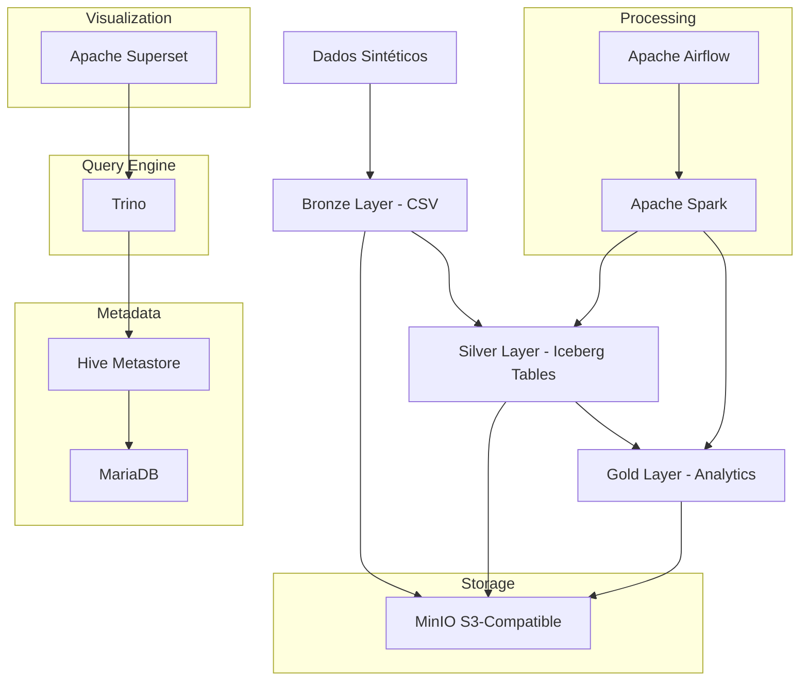

# Modern Data Lakehouse Pipeline

[](https://airflow.apache.org/)
[](https://spark.apache.org/)
[](https://iceberg.apache.org/)
[](https://min.io/)
[](https://trino.io/)

Um pipeline de dados moderno e escalável implementando a arquitetura Medallion (Bronze → Silver → Gold) usando tecnologias de ponta do ecossistema Apache.

## 🏗️ Arquitetura



## 🎯 Características Principais

### 📊 Arquitetura Medallion
- **Bronze**: Dados brutos em formato CSV particionados por batch
- **Silver**: Tabelas Iceberg com schema estruturado e qualidade de dados
- **Gold**: Agregações e métricas analíticas para consumo

### 🔧 Stack Tecnológico
- **Orquestração**: Apache Airflow com Astronomer CLI
- **Processamento**: Apache Spark (PySpark) 
- **Armazenamento**: Apache Iceberg sobre MinIO (S3-compatible)
- **Metadados**: Hive Metastore com MariaDB
- **Query Engine**: Trino para consultas analíticas
- **Visualização**: Apache Superset
- **Containerização**: Docker Compose

### 🚀 Funcionalidades
- **Multi-formato**: Suporte a Parquet, ORC e Avro no Iceberg
- **Processamento em Lote**: Ingestão automatizada a cada 10 minutos
- **Dados Sintéticos**: Geração automática de dados financeiros realistas
- **Upserts**: Merge incremental com deduplicação
- **Particionamento**: Estratégias otimizadas por formato
- **Monitoramento**: Dashboards e métricas de pipeline

## 📁 Estrutura do Projeto

```
modern-data-lakehouse/
├── dags/                          # DAGs do Airflow
│   ├── 1_generate_bronze_batch.py # Geração de dados sintéticos
│   ├── 2_bronze_to_silver.py      # Processamento Bronze → Silver
│   └── 3_silver_to_gold.py        # Analytics Silver → Gold
├── config_trino/                  # Configurações do Trino
│   ├── catalog/
│   │   └── iceberg.properties     # Catálogo Iceberg
│   ├── config.properties
│   ├── jvm.config
│   └── node.properties
├── config_hive/                   # Configurações Hive Metastore
│   └── metastore-site.xml
├── docker-compose.override.yml    # Definição dos serviços
├── airflow_settings.yaml         # Configurações Airflow
├── requirements.txt              # Dependências Python
└── README.md
```

## 🚀 Quick Start

### Pré-requisitos
- Docker Desktop
- Docker Compose
- Astronomer CLI
- 8GB+ RAM disponível
- 20GB+ espaço em disco

### 1. Configuração Inicial

```bash
# Clone o repositório
git clone <repository-url>
cd lakehouse-file-format-compare

# Inicializar projeto Astronomer
astro dev init

# Criar diretório para dados MinIO
mkdir -p ~/minio-data  # Ajuste conforme seu sistema
```

### 2. Iniciar Serviços

```bash
# Subir toda a infraestrutura
astro dev start

# Verificar status dos serviços
docker ps
```

### 3. Acessar Interfaces

| Serviço | URL | Credenciais |
|---------|-----|-------------|
| Airflow | http://localhost:8080 | admin/admin |
| MinIO Console | http://localhost:9001 | minioadmin/minioadmin |
| Trino | http://localhost:8085 | - |
| Spark Master | http://localhost:8081 | - |
| Superset | http://localhost:8088 | admin/admin |

### 4. Executar Pipeline

```bash
# 1. Gerar dimensões de tempo (executar uma vez)
# No Airflow UI: trigger "generate_time_dimensions"

# 2. Gerar dados sintéticos (automatico a cada 10min)
# No Airflow UI: trigger "generate_bronze_batch"

# 3. Processar Bronze → Silver (automatico a cada 12min)
# No Airflow UI: trigger "bronze_to_silver_batch"

# 4. Gerar Analytics Gold (automatico a cada 15min)
# No Airflow UI: trigger "silver_to_gold_analytics"
```

## 📊 Modelo de Dados

### Dimensões
- **d_customers**: Clientes e informações pessoais
- **d_customer_identifiers**: CPF, RG e outros identificadores
- **d_products**: Produtos financeiros (cartão, conta, investimentos)
- **d_transaction_types**: Tipos de transação (financeiras/não-financeiras)
- **d_country/state/city**: Hierarquia geográfica
- **d_time/year/month/week/weekday**: Dimensões temporais

### Fatos
- **f_contracts**: Contratos de produtos por cliente
- **f_contract_attributes**: Atributos flexíveis dos contratos
- **f_transactions**: Transações financeiras detalhadas

### Analytics (Gold Layer)
- **monthly_balance**: Saldos mensais por contrato
- **customer_summary**: Resumo analítico por cliente
- **daily_transaction_metrics**: Métricas diárias de transações
- **product_ranking**: Ranking de produtos por performance

## 🔧 Configuração Avançada

### Ajustar Volume de Dados
Edite as constantes em `dags/1_generate_bronze_batch.py`:

```python
BATCH_SIZE_CUSTOMERS = random.randint(100, 500)    # Clientes por batch
BATCH_SIZE_CONTRACTS = random.randint(200, 800)    # Contratos por batch  
BATCH_SIZE_TRANSACTIONS = random.randint(1000, 5000) # Transações por batch
```

### Modificar Scheduling
Ajuste os schedules nos DAGs:

```python
# Geração de dados (padrão: 10min)
schedule="*/10 * * * *"

# Bronze → Silver (padrão: 12min)  
schedule="*/12 * * * *"

# Silver → Gold (padrão: 15min)
schedule="*/15 * * * *"
```

### Configurar Formatos Iceberg
Os dados são processados em 3 formatos simultaneamente:
- **Parquet**: Melhor para analytics (padrão recomendado)
- **ORC**: Otimizado para Hive/Spark
- **Avro**: Ideal para schema evolution

## 📈 Monitoramento e Observabilidade

### Métricas do Pipeline
- Volume de dados processados por batch
- Tempo de execução por DAG
- Taxa de sucesso/falha
- Utilização de recursos Spark

### Logs e Debug
```bash
# Logs do Airflow
astro dev logs

# Logs específicos do Spark
docker logs spark-master
docker logs spark-worker

# Logs do Trino
docker logs trino

# Debug estrutura tabelas
python scripts/debug_table_structure.py

# Validar pipeline
python scripts/validate_pipeline_readiness.py
```

### Consultas de Exemplo (Trino)

```sql
-- Ver tabelas disponíveis
SHOW TABLES IN iceberg.silver;
SHOW TABLES IN iceberg.gold;

-- Analytics de transações
SELECT 
    produto,
    SUM(volume_financeiro) as total_volume,
    COUNT(*) as total_transacoes
FROM iceberg.gold.product_ranking_parquet 
GROUP BY produto
ORDER BY total_volume DESC;

-- Saldo por cliente
SELECT 
    first_name,
    last_name, 
    saldo_total,
    total_contratos
FROM iceberg.gold.customer_summary_parquet
WHERE saldo_total > 10000
ORDER BY saldo_total DESC;
```

## 🔍 Troubleshooting

### Problemas Comuns

**1. Erro de conexão Hive Metastore**
```bash
# Verificar se MariaDB e Hive estão rodando
docker ps | grep -E "(mariadb|hive)"

# Reiniciar Hive Metastore
docker restart hive-metastore
```

**2. Erro de memória Spark**
```bash
# Ajustar memória no docker-compose.override.yml
environment:
  - SPARK_WORKER_MEMORY=6G  # Aumentar conforme disponível
```

**3. Tabelas não aparecem no Trino**
```bash
# Verificar catálogo Iceberg
docker exec -it trino trino --server localhost:8080
> SHOW CATALOGS;
> SHOW SCHEMAS IN iceberg;
```

**4. MinIO sem espaço**
```bash
# Limpar dados antigos
docker exec -it minio mc rm --recursive --force minio/bronze/
docker exec -it minio mc rm --recursive --force minio/silver/
```

### Performance Tuning

**Spark Configuration**
```yaml
# Ajustar para seu hardware
"spark.executor.memory": "4g"
"spark.driver.memory": "2g"
"spark.executor.cores": "4"
"spark.sql.adaptive.enabled": "true"
```

**Iceberg Table Properties**
```python
# Otimizar tamanho de arquivos
"write.target-file-size-bytes": "134217728"  # 128MB
"write.parquet.compression-codec": "snappy"
```

## 📚 Recursos Adicionais

### Documentação
- [Apache Iceberg Docs](https://iceberg.apache.org/docs/latest/)
- [Trino Iceberg Connector](https://trino.io/docs/current/connector/iceberg.html)
- [Astronomer Documentation](https://docs.astronomer.io/)

### Datasets de Exemplo
O pipeline gera automaticamente:
- 100-500 clientes por batch
- 200-800 contratos por batch
- 1.000-5.000 transações por batch
- Dados históricos de até 2 anos

### Schema Evolution
O Iceberg suporta evolução de schema:
```sql
-- Adicionar nova coluna
ALTER TABLE iceberg.silver.f_transactions_parquet 
ADD COLUMN merchant_name VARCHAR;

-- Renomear coluna  
ALTER TABLE iceberg.silver.f_transactions_parquet
RENAME COLUMN amount TO transaction_amount;
```

## 🤝 Contribuindo

1. Fork o projeto
2. Crie uma branch para sua feature
3. Commit suas mudanças
4. Push para a branch
5. Abra um Pull Request

## 📄 Licença

Este projeto está licenciado sob a Licença MIT - veja o arquivo [LICENSE](LICENSE) para detalhes.

---

**Desenvolvido com ❤️ usando tecnologias open-source**