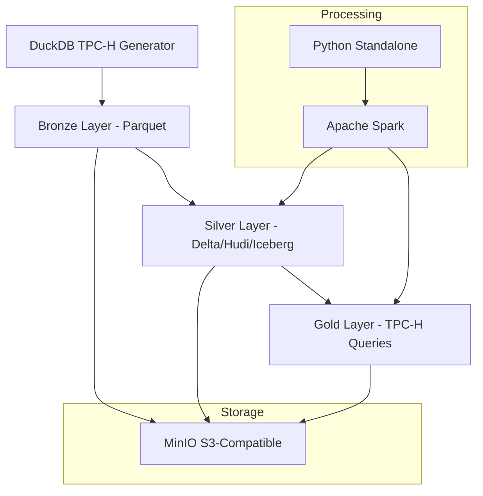

# LHBench v2 - Standalone

Sistema de benchmark TPC-H standalone implementado com Python, Apache Spark e MinIO, sem dependência do Apache Airflow.

## Características

- **Execução Standalone**: Não requer Airflow ou outros orquestradores
- **Containerizado**: Execução completa via Docker Compose
- **Formatos Suportados**: Delta Lake, Apache Hudi, Apache Iceberg
- **Geração de Dados**: DuckDB para dados TPC-H sintéticos
- **22 Queries TPC-H**: Benchmark completo com análise de performance

## Estrutura do Projeto

```
lhbench-v2/
├── standalone/                     # Sistema standalone
│   ├── main.py                    # Ponto de entrada principal
│   ├── config.py                  # Configurações centralizadas
│   ├── bronze_generator.py        # Geração de dados TPC-H
│   ├── silver_converter.py        # Conversão para Delta/Hudi/Iceberg
│   ├── benchmark_executor.py      # Execução das 22 queries
│   ├── tpch_queries.py           # Definições das queries TPC-H
│   └── utils.py                   # Funções utilitárias
├── docker-compose.yml             # Configuração Docker
├── Dockerfile                     # Imagem da aplicação
├── run-docker.sh                  # Script de gerenciamento
└── requirements.txt               # Dependências Python
```

## Início Rápido

### Execução com Docker (Recomendado)

1. **Build da imagem**:
   ```bash
   ./run-docker.sh build
   ```

2. **Teste rápido** (Scale Factor 1):
   ```bash
   ./run-docker.sh quick
   ```

3. **Execução completa** (Scale Factor 10):
   ```bash
   ./run-docker.sh run
   ```

### Execução Local

1. **Instalar dependências**:
   ```bash
   pip install -r requirements.txt
   ```

2. **Configurar variáveis** (copie `.env.example` para `.env`)

3. **Executar**:
   ```bash
   cd standalone
   python main.py
   ```

## Configuração

Principais variáveis de ambiente (`.env`):

```env
SCALE_FACTOR=1                    # Fator de escala dos dados
MINIO_ENDPOINT=minio:9000         # Endpoint do MinIO
MINIO_ACCESS_KEY=minioadmin       # Access key
MINIO_SECRET_KEY=minioadmin       # Secret key
MINIO_BUCKET=lhbench             # Bucket de dados
TABLE_FORMAT=delta                # Formato: delta, hudi, iceberg
```

## Scripts de Gerenciamento

O script `run-docker.sh` oferece os seguintes comandos:

- `build`: Constrói a imagem Docker
- `quick`: Teste rápido (SF=1, apenas Delta)
- `run`: Execução completa (SF=10, todos os formatos)
- `benchmark`: Executa apenas benchmarks
- `clean`: Remove containers e volumes
- `logs`: Mostra logs da aplicação
- `shell`: Acessa shell do container

## Monitoramento

- **MinIO Console**: http://localhost:9001 (minioadmin/minioadmin)
- **Logs**: `./run-docker.sh logs` ou `docker-compose logs -f lhbench`
- **Resultados**: Pasta `results/` com CSVs de benchmark

## Pipeline de Execução

1. **Bronze**: Geração de dados TPC-H via DuckDB
2. **Silver**: Conversão para formatos analíticos (Delta/Hudi/Iceberg)
3. **Gold**: Execução das 22 queries com medição de performance

## Arquitetura



## Requisitos

- Docker e Docker Compose v2
- 8GB+ RAM recomendado
- 20GB+ espaço em disco para dados completos

## Desenvolvimento

Para contribuir com o projeto:

1. Clone o repositório
2. Crie uma branch: `git checkout -b feature/nova-funcionalidade`
3. Faça as alterações e testes
4. Commit: `git commit -m "Adiciona nova funcionalidade"`
5. Push: `git push origin feature/nova-funcionalidade`
6. Abra um Pull Request

## Licença

Este projeto está licenciado sob a Licença MIT - veja o arquivo [LICENSE](LICENSE) para detalhes.
